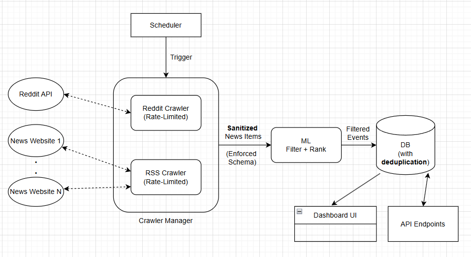

> Note: The repository will be made private right-after it gets reviewed. It is currently made public since I do not have the Github accounts of the reviewers, and as such can't add them as collaborators within a private repository.

## System Diagram



## Refelctions

Written refelctions, thought-process, and decision-making for each component of out system is present at `reflections/README.md`

## Project Structure

```
src/
├── crawlers/
    ├── all_crawlers.py               # Contains all the below crawlers in one development script (redundant code - imported all
                                      # throughout the project - *decided against removing it*)
    ├── base_crawler.py               # Base class to inherit from    
    ├── reddit_crawler.py             # Reddit API Crawler
    ├── rss_crawler.py                # RSS-based News Websites Crawler
    ├── mock_crawler.py
    ├── source_crawler_manager.py     # Orchestrator that handles the logic across different crawlers
    ├── scehmas.py                    # Pydantic Model for a NewsItem object
    └── utils.py                      # utility functions - mainly an html sanitization function

├── db/
    ├── base_storage.py               # Contains persistent DB Class
├── ml/
    ├── it_critical_filter.py         # ML-based filtering and scoring Class
├── routers/
    ├── endpoints.py                  # Endpoints
├── scheduler/
    ├── simple_scheduler.py           # Scheduler to regularly fetch news, filter, and store them       
├── tests/                            # Contains relevant test scripts for different modules
└── config.py                         # Contains config parameters used across the project

ui/
└── simple_dashboard.py               # Streamlit-based UI

reflections/
└── README.md                         # Though Process and Decision-Making
```

## Setup

- Clone Repository and `cd` to project root
- Create venv with `python -m venv venv` - `Python 3.10.11` was used during development but neighbouring versions should also be feasible.
- Install Requirements and Setup - a `pyproject.toml` would have been more suitable.
  
  ```
  pip install -r requirements.txt
  pip install -e .
  ```

## Usage

Make sure you are at the project root.

### API / Endpoints

Run the below to start the api app / server on http://localhost:8000 - access docs by appending `/docs` if needed.

> Note 1: Starting the server will take a few seconds as our ML model shards are downloaded from huggingface and cached on your local system - Please have an internet connection.

> Note 2: Our persistent DB will only be created upon calling your **first** `/ingest` request under the default name of `filtered_events.json`. If you plan to run multiple test batches separately, and evaluate each in an isolated manner through the `/retrieve` endpoint, please make sure to manually delete the `filtered_events.json` db before each run.

```
python src\routers\endpoints.py
```

On a separate terminal window, also at project root, run your curl requests.

```
# Example on /ingest

curl -X POST "http://localhost:8000/ingest" \
  -H "Content-Type: application/json" \
  -d '[
    {
      "id": "sec-001",
      "source": "reddit",
      "title": "Critical security vulnerability discovered in Apache Log4j",
      "body": "A severe remote code execution vulnerability has been found in Apache Log4j library affecting millions of applications worldwide. Immediate patching required.",
      "published_at": "2024-12-15T10:30:00Z"
    }
  ]'

# Followed by an Example on /retrieve

curl -X GET "http://localhost:8000/retrieve"
```

### Accessing the UI

A simple Streamlit-based dashboard can be accessed through the below command. The dashboard will read the persistent storage created earlier and display the filtered news items along with their scores. Note that the UI needs to be refreshed after every update to the DB to see the changes.

```
streamlit run ui\dashboard_simplified.py
```

### Running the Full System: Crawl → Filter → Store → Visualize → Repeat

To run the web crawler / aggregator system, open three separate terminal windows (Apologies, a better entry point is the next task on the list). From the project root:

1. Start the API Server
   ```
   python src\routers\endpoints.py
   ```
2. Run the Scehduler (responsive for crawling and aggregating website at regular polling intervals)
   ```
   python src\scheduler\simple_scheduler.py
   ```
3. Run the Streamlit dashboard to visualize results from a continuously updated DB
   ```
   streamlit run ui\dashboard_simplified.py
   ```

## Dashboard Snapshots

**Relevance-based Ranking**


**Relevance x Recency-based Ranking** :

To compute the hybrid scoring, we use an exponential time decay. This is done only at the UI level (Not at the API or DB level), and the DB does not store or frequently update the scoring.


