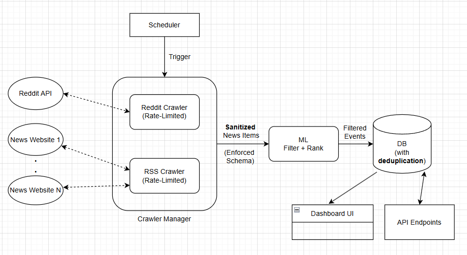

## Thought Process

### First Things First

I started with reading the assignment pdf a couple of times, highlighting key requirements and aspects. After whcih, I decide to draw up the high-level (and simplified) design / architecture of our system. This diagram acts as the main guide to our development process.

### Crawlers & Manager

Different crawlers / aggregators were created based on source-type. All crawlers are built ontop of a `BaseCrawler` class, and have a naive rate-limiting implementation so that we respect any crawled API's limit if needed. 

All retrieved news are first sanitized and stripped of possible xml/html tags, using the `beautifulsoup4`. Additionally, `aiohttp` is used to open client sessions and send requests. The initial reasoning was so that the system can perform async crawling across the different crawlers through `aiohttp` which might not be possible through `requests`. However, the final implementation did not leverage this capability and rather relies on sequential crawling.

#### Reddit Crawler

The `RedditCrawler` is designed to fetch IT-related posts from Reddit subreddits using Reddit's **public JSON API**. USing the public API allows us to get post metadata we wouldn't get otherwise from RSS. Some metada, while not used in this assignment, can offer strong signals (e.g. upvotes, downvotes) to help build source-specific filtering and ranking logic if needed. 

One little trick, used out of curiosity, is that we query the `/r/{subreddit}/hot.json`, which lets us get the "hot" (trending) posts rather than just newest. The intuiton was for this to already act as a first-step of important posts within the subreddit of choice.

The crawler also allows you to add more subreddits to crawl, by appending the subreddit name to the list of supported channels in `src/configure.py`.

#### RSS Crawler - News Articles

The `RSSCrawler` is designed to fetch IT news from news websites using their RSS (a standardized xml format) feeds. The choice of RSS over HTML was mainly for simplicity's sake, given that RSS feeds are structured and thus easier to parse, while html layouts change from site to site. It is important, however, to note that retrieved RSS feeds can lack some context in comparison to HTML. The RSS feeds are parsed using `feedparser` instead of a shaky regex-based parsing code.

The crawler also allows you to add any target websites to the list of supported ones in `src/configure.py`.

#### Manager

The `SourceCrawlerManager` is a basic orchestrator meant to hold any specific logic with regards to coordinating the different crawlers. In this implementation, we simply call the configured crawlers sequentially and concatenate their retrieved samples. 

#### Schema

All retrieved items/events are converted to a `Pydantic` Model/Schema (based on the required API contract), ensuring consistency across inputs.

### ML - Model  

When designing the ML module for filtering and ranking IT-critical news, I faced two core design questions:

1. Should filtering and ranking/scoring be implemented as separate components, or combined into a single approach?
2. How do we handle the scarcity of labeled data, given that we lack access to ground truth or production-scale datasets?

To address the data challenge, avoid ad-hoc heuristics, and reduce implementation time, I opted for **zero-shot** models / classifiers. This leverages pre-trained models’ foundational knowledge to handle the downstream task of identifying IT-critical news without task-specific fine-tuning.

Additionally, To reduce time implementation overhead, I combine filtering and scoring into a single step: the model’s logits are used both to determine whether a news item is IT-critical and to rank items by relevance.

This approach relies on the assumption that the chosen model is **well-calibrated**, i.e. its confidence scores (quanitified through its logits) are proportional to real-world accuracy. As such, if a model is confident in its answer, it is highly likely that the answer is correct, and vise versa.

However, testing whether a model is well-calibrated or not requires an external setup and analysis, which although easily implementable, requires time. I thus assume **Calibration** as a present precursor in any model we choose. 

Moreover, I assume all our inputs are in the English language, which simplifies the choice of candidate models by removing the need for **multilingual** support.

Given the above, I settled on two possible options:

1. `Flan-T5-XL`: 
   - Strength: Known for relatively good calibration. Using it in an NLI (Natural Language Inference) setup, i.e. testing whether a hypothesis like “This news is IT-critical” is entailed by the input, naturally provides both filtering (entailment vs. not) and ranking (via logits).
   - Limitation: Large size (~800M parameters), making it less practical for CPU-based inference
   
2. `ModernBERT-base-mnli`: 
   - A ModernBERT-base model finetuned on NLI tasks but also allows for zero-shot classification on any given set of labels. It is only 150M parameters and thus quite CPU-friendly.
   - Limitation: Calibration properties are not known, and its small size can mean lower performance on OOD-tasks such as IT-critical classification. 

Given the assumption (notably that calibration holds),  `ModernBERT-base-mnli` was selected in a `zero-shot` setup with labels `[IT-Critical, Not-IT-Critical]`. Emphasis should be put on the *Critical* qualifier, as it helps exclude generic IT-related but non-critical updates (e.g., routine product releases).

> Please Note that model selection should be based on systematic evaluation on domain-related and custom benchmarks. This step was skipped in the above selection process; decision were based on assumptions and high-level reasoning given the scope of the assignment.

To evlauate the above model and label selection, I synthesize around 10 samples of IT-critical and non-IT-critical news, and tested the model's performance on them. It is important to note that the synthesized samples do not necessarily align with production-data the system will be exposed to, nor do they offer enough samples to draw a statistically robust conclusion on performance.

These synthetic examples can be found in the API test scripts `src/tests/test_api.sh`  and `src/tests/quick_test_api.py`. `torch` and `transformers` libraries were used to run model inference.

> A note regarding scoring: Only the model score is stored in the DB per item. the effect of recency-based decay on the score is implemented on-the-fly at the UI level.

### Metric - Relevance x Recency

To compute the Relevance x Recency hybrid scoring, we use an exponential time decay. A simple and effective formula is:
`hybrid_score = relevance_score * exp(-age_hours / half_life)`

`age_hours` = hours since publication.

`half_life` = how fast the decay should happen (e.g. 24h → score halves every 24 hours).

The Project's README shows a UI comparison of the change in scores and ranking between relevance-only ranking and relevance-x-recency ranking.

### DB / Storage

A persistent storage was used, instead of in-memory storage, to still retain the retrieved critical IT news in case they have not been handled yet and our server dies.

`TinyDB` was used for its prototyping/plug-and-play ease, json-based nature, and supported search queries. However, given the relational nature of the stored samples, an SQL DB is probably the way to go in production, depending on the scale of crawling and querying required.

While the main pipeline only stores filtered items/events into the DB, an additional class `StorageManager` was also implemented to allow for the storage of both filtered events and **raw events**, (i.e. all initially crawled items). This would allow us to test (A/B testing, etc.) and monitor our filtering-and-ranking module across future development cycles.

All filtered news items are checked for duplication before being stored in the DB. **Hash-based deduplication** happens on the ID-level (e.g. crawled the exact post twice across different polls or runs), and on the content-level (e.g. different IDs but similar content).

### Scheduler

A naive polling-based scheduler is implemented to run the `Crawl → Filter → Store` cycle at regualr intervals. The interval duration can be set in `src/configure.py`.

Polling scheduler to fetch news items from the different sources at regular intervals.

### UI

A quick `Streamlit` dashboard was developed to showcase the filtered and ranked items. Upon each refresh request, the UI reads the DB and pulls in the latest updates.

A simple feature was added to allow the user to sort by relevance score, recency, or a haybrid score of both. The hybrid score is computed on-the-fly and is not stored in the DB for now (which would require frequent DB updates to decay each item's score based on recency).

### API

The API strictly implements the two core endpoints defined in the requirements, using `FastAPI`:

- POST `/ingest`: accepts raw news events, filters them for IT-critical relevance, and persists them (DB is either created or updated upon calling this request).
- GET `/retrieve`: returns previously ingested, filtered events ranked by relevance. 

Note that recency was not taken into account in the `/retrieve` endpoint, but rather implemented to affect the score on the UI side. This decision stems from the fact that any design choice made regarding the effect of receny should be co-desinged with the user, and based on user-behavior and preferences.

`Pydantic` models are used for input/output validation (`NewsItem`, `IngestResponse`). This guarantees consistent request/response formats and simplifies integration testing.

Simple endpoints to support monitoring were also implemented:
- `/health` for system health checks.
- `/stats` for visibility into item count, sources, and score distribution.

> Note that the ML model is download and cached upon starting the API server.

### Tests

Basic test functions were implemented to validate the core functionality of the crawlers, API endpoints, and storage/DB class. These tests were developed rapidly, with support from Claude-Sonnet, to identify fundamental bugs and confirm baseline functionality. However, they currently do not cover edge cases and are not structured within a unittest framework. As such, they are intended for quick prototyping rather than production-level reliability.

The tests are present at `src/tests/`.

### Limitations

- No automatic refresh in the UI  
- Recency decay applied only at the UI level  
- Model calibration assumptions may affect scoring  
- RSS scraping capped per site with default limits  
- Subreddit handling for comments is incomplete  
- Zero-shot labels are not fully optimized 

### Bonus Question

